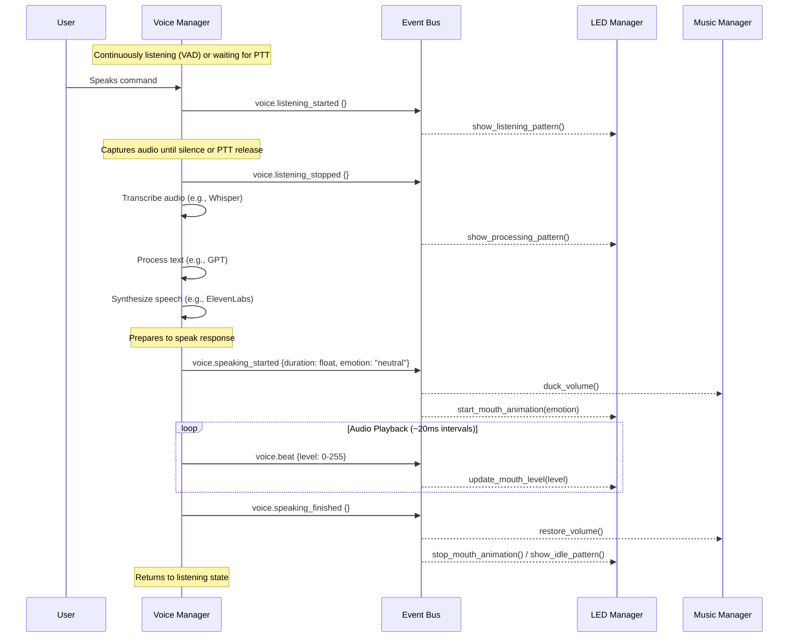

# DJ R3X — Lights & Voice MVP v2 (Integrated Voice)
High-level architecture & delivery notes for the voice-first, event-driven approach.

## 1. Goal (MVP)

"R3X continuously listens for voice input (or uses Push-to-Talk). When speech is detected and processed, R3X ducks any background music, speaks a GPT + ElevenLabs generated response, and animates his eye/mouth LEDs in sync with the voice. The system runs as a single Python application."

## 2. Core Components

| Abbrev. | Role                                       | Runs where        | Tech                                              |
| :------ | :----------------------------------------- | :---------------- | :------------------------------------------------ |
| **PM**  | Python Main process                        | Mac/PC/Pi         | `asyncio`, `dotenv`, `argparse`                   |
| **VM**  | Voice Manager (Audio I/O, VAD, STT->GPT->TTS) | inside PM         | `speech_recognition`, `sounddevice`, `pynput`?, `whisper`, `openai`, `requests`/`httpx`, `numpy` |
| **LM**  | LED Manager (Animations)                   | inside PM (v1)    | `rpi_ws281x` / `adafruit-neopixel` via `pyserial` (USB-UART) |
| **MM**  | Music Manager (Background Playback)        | inside PM         | `python-vlc` / Spotify API                       |
| **EB**  | Event Bus (In-process Coordination)      | inside PM         | `pyee.AsyncIOEventEmitter`                        |

*Future:* Move LM to ESP32 (MQTT), add Servo Manager, Sensor Hub, etc.

## 3. Runtime Sequence (Voice Interaction)



## 4. Event Definitions (v2)

| Event                   | Payload JSON                            | Published by | Notes                                                    |
| :---------------------- | :-------------------------------------- | :----------- | :------------------------------------------------------- |
| `system.ready`          | `{}`                                    | PM           | After all managers initialized successfully.             |
| `system.shutdown`       | `{}`                                    | PM           | Graceful shutdown initiated.                             |
| `system.error`          | `{source: str, msg: str}`               | Any          | Logged error, potentially for UI display.                |
| `voice.listening_started` | `{}`                                    | VM           | VAD detected speech or PTT pressed.                      |
| `voice.listening_stopped` | `{}`                                    | VM           | VAD detected silence or PTT released.                    |
| `voice.processing_started`| `{}`                                    | VM           | Transcription/LLM/TTS pipeline initiated.                 |
| `voice.speaking_started`| `{duration: float, emotion: str}`     | VM           | TTS audio playback is about to begin.                    |
| `voice.beat`            | `{level: 0-255}`                        | VM           | Audio level update during TTS playback (~50fps).         |
| `voice.speaking_finished` | `{}`                                    | VM           | TTS audio playback completed.                            |
| `music.track_started`   | `{title: str, artist: str, bpm: int}` | MM           | Background music started playing.                        |
| `music.volume_ducked`   | `{level: float}`                        | MM           | Music volume reduced.                                    |
| `music.volume_restored` | `{level: float}`                        | MM           | Music volume returned to normal.                         |
| `led.animation_started` | `{name: str}`                           | LM           | An LED animation sequence began.                         |
| `led.animation_stopped` | `{name: str}`                           | LM           | An LED animation sequence ended.                         |

## 5. Files & Modules

```
src/
 ├─ main.py              # App entry point, init, main loop, signal handling
 ├─ bus.py               # EventBus class and EventTypes enum
 ├─ voice_manager.py     # Handles audio I/O, VAD, STT, LLM, TTS, voice events
 ├─ led_manager.py       # Handles LED hardware comms, animations, LED events
 ├─ music_manager.py     # Handles audio playback, volume control, music events
 ├─ audio_processor.py   # Optional: Applies audio effects to TTS output
 ├─ config/
 │   └─ app_settings.py    # Centralized configuration
 │   └─ voice_settings.py  # ElevenLabs voice parameters
 │   └─ openai_settings.py # OpenAI API parameters
 └─ utils/
      └─ envelope.py     # Audio analysis (RMS/peak) for beat events
audio/
 ├─ bgmusic/             # Default background music files
 └─ soundfx/             # System sounds (e.g., listening chime)
.env                     # API keys, sensitive config
requirements.txt         # Python dependencies
```

## 6. Hardware Hookup (Mega Version)

| Pin | Connects to                   | Why                         |
| :-- | :---------------------------- | :-------------------------- |
| D6  | Din of first 8x8 NeoPixel matrix | One-pin LED control         |
| 5V  | LED 5V rail (≥2A recommended) | Power                       |
| GND | Common ground                 | Reference                   |

*Future:* Swap Mega for ESP32-S3 (LED RMT, Wi-Fi for MQTT/OTA).

## 7. Outstanding TBD / Future Ideas

| Area            | MVP Choice                            | Future Idea                                        |
| :-------------- | :------------------------------------ | :------------------------------------------------- |
| Beat Extraction | RMS envelope in Python (`utils`)      | WebAudio in dashboard; FFT on ESP32                |
| Voice Latency   | VAD or PTT stream w/ local processing | Cloud VAD/STT for lower resource use               |
| Event Bus       | In-process (`pyee`)                   | External MQTT (`mosquitto`) for distributed system |
| LED Driver      | USB Serial to Arduino/Mega            | ESP32 (RMT driver, MQTT control, OTA patterns)   |
| Music Ducking   | `vlc.audio_set_volume()` steps        | Side-chain compressor; WebAudio API in dashboard     |
| UI / Control    | CLI logs only                         | Next.js dashboard (status, logs, controls, visualizer) |
| Configuration   | `app_settings.py` + `.env`            | Central config service; UI-based config            |

## 8. Acceptance Test (Voice-First)

1.  **Start:** Run `python src/main.py` (no wrapper script needed).
    *   *Expected:* Log shows components initializing, then "System Ready", "Voice Manager listening...". LEDs show an idle pattern. Background music starts (if configured).
2.  **Speak:** Say "Hello R3X".
    *   *Expected:*
        *   Log shows `voice.listening_started`.
        *   LEDs change to a 'listening' pattern.
        *   Log shows `voice.listening_stopped` shortly after speech ends.
        *   Log shows `voice.processing_started`.
        *   LEDs change to a 'processing' or 'thinking' pattern.
3.  **Response:** R3X generates and speaks a response (e.g., "Hello there!").
    *   *Expected:*
        *   Log shows `voice.speaking_started`.
        *   Music volume drops (`music.volume_ducked`).
        *   LEDs begin mouth animation (`led.animation_started`).
        *   Log shows periodic `voice.beat` events.
        *   LED mouth pattern pulses roughly in sync with the spoken audio (<100ms lag).
4.  **Finish:** Speech completes.
    *   *Expected:*
        *   Log shows `voice.speaking_finished`.
        *   Music volume returns to normal (`music.volume_restored`).
        *   LEDs stop mouth animation and return to idle pattern (`led.animation_stopped`).
        *   Log shows "Voice Manager listening..." again.

*If all pass → MVP complete.*

## 9. Dependencies / Install Snippet

```bash
# Create and activate virtual environment (recommended)
python -m venv venv
source venv/bin/activate  # Use `venv\Scripts\activate` on Windows

# Install core dependencies
pip install python-dotenv pyee asyncio python-vlc openai elevenlabs sounddevice numpy

# Install GPIO/LED dependencies (if using Raspberry Pi directly)
# pip install rpi_ws281x adafruit-circuitpython-neopixel

# Or, if controlling Arduino/ESP via Serial
pip install pyserial

# Install for Speech Recognition & Mic Input
pip install SpeechRecognition

# Install for Push-to-Talk (optional)
pip install pynput

# Install for ElevenLabs REST API calls
pip install requests # or httpx for async

# Install for startup sound (optional)
# pip install pygame

# Install Whisper (choose based on system/needs)
# pip install -U openai-whisper
# pip install -U faster-whisper

# Ensure ffmpeg is installed for audio processing/conversion
# On macOS: brew install ffmpeg
# On Debian/Ubuntu: sudo apt update && sudo apt install ffmpeg
# On Windows: Download from official site and add to PATH
```
*(Adjust based on final library choices, especially for STT and LED control)*

## 10. Implementation Plan (Integrated Voice)

Refactor the application to use `main.py` as the entry point and integrate core voice interaction logic into `VoiceManager`.

1.  **Configuration Consolidation:**
    *   Modify `main.py` to load `.env` directly using `python-dotenv`.
    *   Modify `main.py` to import base settings from `src.config.app_settings`.
    *   Load specific voice generation settings from `src.config.voice_settings` and OpenAI settings from `src.config.openai_settings`.
    *   Load `DJ_R3X_PERSONA` from file (if specified) or environment variable.
    *   Pass necessary config values explicitly to Manager constructors (`VoiceManager`, `LEDManager`, `MusicManager`). Ensure API keys and persona are passed securely.
    *   Remove the need for `run_rex.py`.

2.  **Enhance `VoiceManager` for Audio I/O & Processing:**
    *   Integrate audio input stream handling using `sounddevice` or `speech_recognition`'s `Microphone` source within an `asyncio` compatible way (e.g., `run_in_executor`).
    *   Add Voice Activity Detection (VAD). Use `speech_recognition`'s `listen` (potentially blocking, needs care) or implement/integrate a dedicated VAD library (e.g., `webrtcvad-wheels`).
    *   Implement the core async listening loop: `listen -> VAD -> capture -> transcribe -> process -> speak`.
    *   Add methods like `start_interaction_loop()` (called by `main.py`) and internal async methods for the processing pipeline.
    *   Integrate transcription using the `WhisperManager` (ensure model loading is handled).
    *   Integrate OpenAI call using the `openai` library, passing the persona and user input.
    *   Integrate ElevenLabs TTS call using `requests` (sync, in executor) or `httpx` (async), passing text and voice settings from config.
    *   Determine audio playback strategy: Use `sounddevice` for direct playback if `DISABLE_AUDIO_PROCESSING` is true, otherwise call `audio_processor.process_and_play_audio` (needs to be adapted for async/event usage).
    *   Implement push-to-talk (PTT) logic using `pynput` listener (running in a separate thread or executor) to signal the main loop via an `asyncio.Event` or queue, if `PUSH_TO_TALK_MODE` is enabled.
    *   Emit the new voice events (`listening_started`, `listening_stopped`, `processing_started`, etc.) on the `EventBus`.
    *   Handle `TEXT_ONLY_MODE` flag to bypass TTS and playback.
    *   Consider adding a dummy/fallback mode if essential services (like ElevenLabs) fail.

3.  **Update `main.py`:**
    *   Adjust `initialize_components` to pass the more detailed config objects/values to managers.
    *   Consider adding optional startup sound playback using `pygame.mixer` (initialized appropriately).
    *   In the main execution block, after successful initialization:
        *   Emit `system.ready`.
        *   Start background music (if configured).
        *   Start the `VoiceManager`'s main interaction loop (e.g., `await voice_manager.start_interaction_loop()`).
        *   The primary loop in `main` becomes `await shutdown_event.wait()`.
    *   Ensure `cleanup_components` correctly stops the `VoiceManager` loop and other managers.
    *   Remove `demo_mode` and `interactive_cli_mode` or adapt them significantly if still needed for testing.

4.  **Refine Event Handling in Other Managers:**
    *   Ensure `LEDManager` subscribes to `voice.listening_started`, `voice.processing_started`, `voice.speaking_started`, `voice.beat`, `voice.speaking_finished` to trigger appropriate animations (idle, listening, thinking, speaking).
    *   Ensure `MusicManager` subscribes to `voice.speaking_started` (to duck) and `voice.speaking_finished` (to restore).

5.  **Testing & Refinement:**
    *   Test the end-to-end voice flow thoroughly.
    *   Tune VAD parameters for responsiveness.
    *   Verify event timing and synchronization (especially LEDs and music ducking).
    *   Ensure graceful shutdown works correctly.

This plan centralizes the voice interaction logic within the main application structure, leveraging the event bus for coordination with other components like LEDs and music.