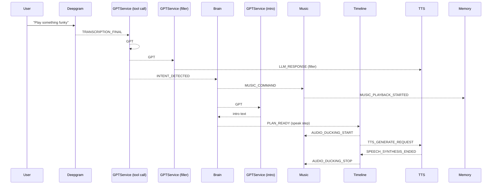

# DJ R3X Layered Architecture — Product Requirements Document (v3)

## 1 Purpose

Ship a minimal “layered” runtime that lets DJ R3X

1. recognise a spoken song request
2. start the requested track instantly
3. talk over the music twice
   • a quick filler line immediately (no ducking)
   • a track‑aware intro line a bit later, with music ducked
4. keep every action event‑driven and future‑proof for lights, motion, seasonal modes

---

## 2 Scope (MVP)

* **BrainService** — GPT‑backed planner; turns intents + Memory into a declarative **Plan**
* **TimelineExecutorService** — layered cue engine; runs Plans, handles ducking, waits, beats
* **MemoryService** — shared working memory; publishes state + chat history

Legacy services (Deepgram, GPTService, ElevenLabs, MusicController, EyeLights, Pololu) stay unchanged.

---

## 3 Three‑Call GPT Pattern

1. **Tool call** (`tool_choice="auto"`) → `play_music`
2. **Filler call** (`tool_choice="none"`) → quick line, streamed immediately; no Brain involvement
3. **Track‑intro call** (`tool_choice="none"`) fired by Brain after `MUSIC_PLAYBACK_STARTED`, becomes a one‑step Plan



---

## 4 Service Responsibilities

### BrainService

* **Subscribes** → `INTENT_DETECTED`, `MUSIC_PLAYBACK_STARTED`
* **Emits** → `MUSIC_COMMAND`, `PLAN_READY`, `MEMORY_UPDATED`
* **Flow**

  1. forward tool command immediately
  2. write intent + chat into Memory
  3. after music starts → GPT call #3 → wrap intro line in Plan → emit `PLAN_READY`

### TimelineExecutorService

* **Subscribes** → `PLAN_READY`
* **Layers** → `ambient`, `foreground`, `override`
* **Rules**
  • override cancels lower layers
  • foreground pauses ambient; ambient resumes on finish
* **Speak sequence** → duck → TTS → wait → unduck

### MemoryService

Keys: `mode`, `music_playing`, `current_track`, `last_intent`, `chat_history`
API: `set`, `get`, `append_chat`, `wait_for(predicate)`
Listens to core events; emits `MEMORY_UPDATED`.

---

## 5 Plan Schema (Pydantic)

```python
class PlanStep(BaseModel):
    id: str
    type: Literal[
        "play_music", "speak", "eye_pattern",
        "move", "wait_for_event", "delay"
    ]
    text: Optional[str] = None
    clip_id: Optional[str] = None
    genre: Optional[str] = None
    event: Optional[str] = None
    delay: Optional[float] = None
    pattern: Optional[str] = None
    motion: Optional[str] = None

class Plan(BaseModel):
    plan_id: str = Field(default_factory=lambda: str(uuid.uuid4()))
    layer: Literal["ambient","foreground","override"]
    steps: List[PlanStep]
```

---

## 6 Execution Lifecycle

* Plan stored by layer; each layer runs its own coroutine.
* Step state: `pending → ready → running → done / cancelled`.
* A step becomes **ready** when its `delay` elapses or its `wait_for_event` fires.
* Instrumentation events: `PLAN_STARTED`, `STEP_READY`, `STEP_EXECUTED`, `PLAN_ENDED`.

---

## 7 Events Added

`PLAN_READY`, `PLAN_STARTED`, `STEP_READY`, `STEP_EXECUTED`, `PLAN_ENDED`, `MEMORY_UPDATED` (+ optional `TTS_PREGENERATE_REQUEST`).

---

## 8 Latency Targets

* Voice → music ≤ **1.25 s**
* Music start → intro line ≤ **1.5 s** (ducking included)
* Quick filler ≤ **1 s** after user stops speaking

---

## 9 Milestone (End‑of‑Day Demo)

* BrainService v0 (GPT call #3 → Plan)
* TimelineExecutor v0 (foreground layer, duck‑speak‑unduck)
* MemoryService v0 (state keys + updates)
* Happy‑path demo meets latency targets

---

## 10 Open Questions

* Default chat‑history length (proposed 10)
* Pre‑generate TTS clip to shave duck gap?
* Local TTS fallback?
* Priority nuance if multiple overrides arrive?

---

## 11 Implementation‑Time Q\&A

* **Brain subscribe code** → wrap `subscribe` calls in `asyncio.create_task`.
* **PLAN\_READY payload** → use the `Plan` model above.
* **Layer tasks** → `self._layer_tasks[layer] = asyncio.create_task(...)`.
* **Filler line path** → `LLM_RESPONSE` with `response_type="filler"`.
* **Memory updates** → hybrid approach: event‑driven + direct helper calls.

---

*End of document.*
