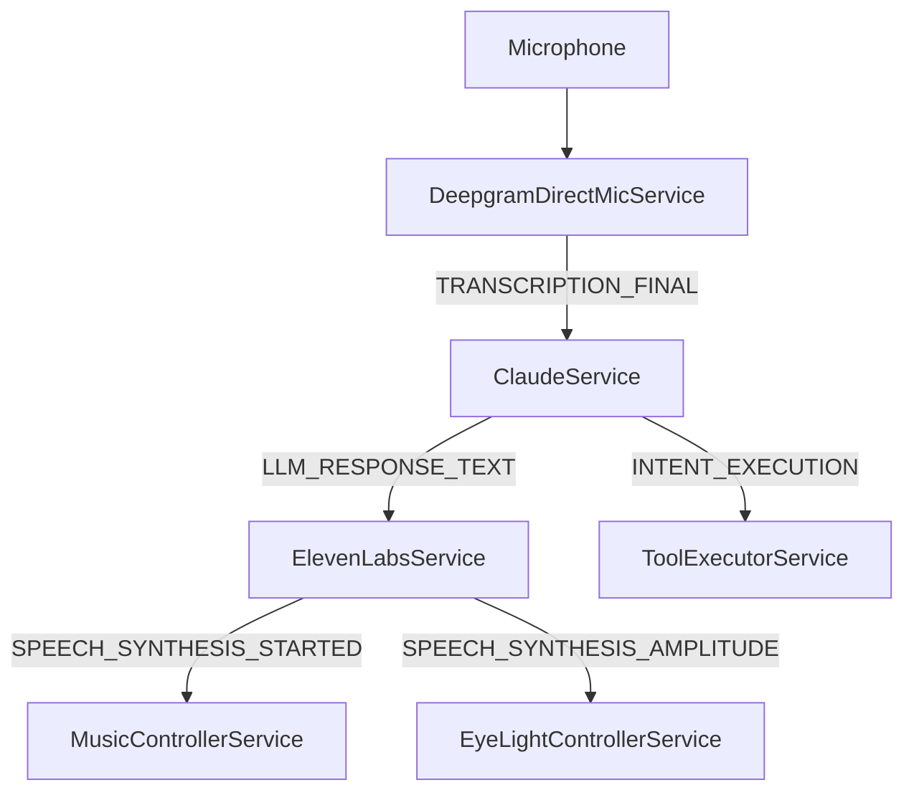

# Testing Frameworks Research for DJ R3X Voice System

**Date:** 2025-11-19
**Research Focus:** Testing approaches for event-driven robotics/voice systems similar to DJ R3X

---

## Executive Summary

This research investigates industry-standard testing approaches across four domains relevant to DJ R3X:

1. **ROS (Robot Operating System)** - Event-driven robotics testing patterns
2. **Voice Agent Testing** - Alexa/Google Assistant dialogue flow testing
3. **Event-Driven Architecture** - Async event bus testing strategies
4. **Hardware-in-the-Loop** - Arduino/embedded systems integration testing

**Key Finding:** DJ R3X already implements many best practices (pytest-asyncio, event synchronization, mocks, tiered testing), but has gaps in:
- Real-time event monitoring/visualization
- End-to-end voice pipeline testing with real APIs
- Distributed tracing for latency analysis
- Hardware-in-the-loop automation

---

## 1. ROS (Robot Operating System) Testing Patterns

### Industry Standard Tools

#### 1.1 rostest - Integration Testing Framework
- **Purpose:** ROS's primary integration test framework, wrapper around unittest
- **How it works:** Uses launch files to start nodes, then runs test scripts
- **Key Features:**
  - Launches multiple nodes for system-level testing
  - Supports C++ (gtest) and Python (unittest/pytest)
  - Automatic cleanup of launched processes
  - XML test result output (xUnit format)

**DJ R3X Parallel:** Similar to how our integration tests start multiple services (MusicController, ElevenLabs, etc.) and test their interactions.

#### 1.2 rostopic - Real-time Topic Monitoring
```bash
rostopic list              # Show all active topics
rostopic echo /topic_name  # Print messages in real-time
rostopic pub /topic_name   # Publish test messages
rostopic hz /topic_name    # Measure message frequency
```

**DJ R3X Gap:** We don't have real-time event monitoring equivalent. Our EventSynchronizer only works within tests.

#### 1.3 rqt_graph - System Visualization
- **Purpose:** Visualize node connections and topic flows
- **Output:** Interactive graph showing publisher/subscriber relationships
- **Use Case:** Debug communication patterns, identify bottlenecks

**DJ R3X Gap:** No visual representation of service dependencies and event flows.

#### 1.4 rosbag - Record & Replay
```bash
rosbag record -a           # Record all topics
rosbag play filename.bag   # Replay recorded data
```

**DJ R3X Opportunity:** Could implement "event bag" recording for debugging production issues.

### ROS2 Modern Testing Patterns (2024)

#### 1.5 colcon test - Build System Integration
```bash
colcon test --packages-select my_package
colcon test --pytest-args -k test_name  # Run specific test
```

**Features:**
- Parallel test execution across packages
- Automatic test discovery
- Integration with CI/CD pipelines

#### 1.6 launch_pytest - Integration Testing with Pytest
- Modern alternative to unittest-based launch_testing
- Better async support and more pythonic syntax
- Supports pre-launch setup and post-shutdown tests

**DJ R3X Parallel:** Our integration tests already follow this pattern (async setup/teardown).

#### 1.7 Test Isolation with Domain IDs
- **Problem:** Parallel tests interfering with each other
- **Solution:** Assign unique ROS domain ID to each test
- **Tool:** `run_test_isolated.py` from ament_cmake_ros

**DJ R3X Status:** We already handle this via isolated event buses per test.

### Key ROS Best Practices

1. **Three-tier testing:**
   - Unit tests (individual node logic)
   - Integration tests (multi-node interactions)
   - System tests (full robot behavior)

2. **Mock objects for hardware:**
   - Replace hardware interfaces with simulators
   - Tools: rostest, rosunit, gtest_ros

3. **Continuous integration:**
   - Run tests on every commit
   - Use Docker for reproducible test environments

**DJ R3X Assessment:** We follow ROS-inspired patterns but lack:
- Real-time monitoring tools
- Visual system diagrams
- Event recording/replay

---

## 2. Voice Agent Testing Frameworks

### 2.1 Platform-Specific Tools

#### Alexa Skills Testing
- **ASK CLI (Alexa Skills Kit):** Command-line testing tool
  ```bash
  ask dialog --locale en-US  # Interactive dialogue testing
  ask simulate --text "..."  # Simulate user utterance
  ```
- **Alexa Developer Console:** Web-based simulator with voice input
- **Unit Testing Framework:** JavaScript/Python test harness for lambda functions

#### Google Actions Testing
- **Actions Console Simulator:** Test dialogue flows in browser
- **Dialogflow CX Test Cases:** Visual test case builder
- **gactions CLI:** Command-line testing and deployment

**DJ R3X Parallel:** Our CLI can be used for command testing, but we lack:
- Simulated voice input (currently requires real microphone)
- Visual dialogue flow testing
- Automated ASR→LLM→TTS pipeline validation

### 2.2 Third-Party Voice Testing Frameworks

#### Bespoken AI (Industry Leader)
- **Website:** https://bespoken.ai/
- **Key Features:**
  - End-to-end voice testing (ASR → NLU → Response)
  - Converts test scripts to audio using TTS
  - Sends audio to real Alexa/Google Assistant
  - Validates responses using speech recognition
  - Load testing and monitoring capabilities

**How it works:**
```yaml
# Example Bespoken test script
---
- test: Play music request
  - "play some jazz music": "Now playing Jazz Radio"
  - "stop": "Music stopped"
```

**Pricing:** Commercial product (enterprise pricing)

**DJ R3X Opportunity:** Similar approach could be implemented:
1. Generate test audio from text using ElevenLabs
2. Send through real Deepgram ASR
3. Validate Claude/GPT responses
4. Check ElevenLabs TTS output

#### Voiceflow
- **Website:** https://vuix.io/ and Voiceflow.com
- **Purpose:** Visual dialogue design and testing
- **Features:**
  - Drag-and-drop conversation flow builder
  - In-browser testing simulator
  - Export to Alexa/Google
  - Conversation analytics

**DJ R3X Gap:** We have no visual representation of conversation flows.

#### TestArchitect
- **Type:** Codeless automation tool
- **Languages:** C#, Java, Python extensions
- **Approach:** Device-agnostic, tests at voice level
- **Use Case:** Enterprise-scale voice app testing

### 2.3 Voice Quality Metrics

#### ASR (Automatic Speech Recognition) Metrics
- **Word Error Rate (WER):** Industry standard
  - Formula: `(Insertions + Deletions + Substitutions) / Total Words`
  - Tools: Hugging Face `datasets` library, jiwer Python package
  - Best Practice: Minimum 30 minutes of test audio for statistical significance

#### TTS (Text-to-Speech) Metrics
- **Mel-Cepstral Distortion (MCD):** Spectral similarity to natural speech
- **WER via ASR:** Round-trip test (TTS → ASR → compare to original text)
- **Mean Opinion Score (MOS):** Human subjective ratings (1-5 scale)
- **TTSDS (TTS Distribution Score):** Neural metric comparing distributions

#### LLM Metrics for Voice Agents
- **Intent Classification Accuracy:** % correct tool/function calls
- **Response Latency:** Time from transcription to TTS start
- **Conversation Coherence:** Multi-turn dialogue consistency
- **Hallucination Rate:** Factually incorrect responses

**DJ R3X Status:**
- We track latency via timestamps
- We don't measure WER, MCD, or intent accuracy
- No formal quality metrics for TTS output

---

## 3. Event-Driven Architecture Testing

### 3.1 Testing Challenges

**Unique Problems:**
- Events may arrive out of order
- Events may be lost or duplicated
- Async processing makes timing unpredictable
- Unit tests don't catch integration issues
- Detached components hard to test in isolation

**Solution Layers:**
1. Unit tests with mocks (fast, isolated)
2. Integration tests with real event bus (catches timing issues)
3. End-to-end tests with real external services (validates full flow)

### 3.2 Pytest-Asyncio Patterns (2024 Best Practices)

#### Event Loop Scope Management
```python
# pytest.ini or conftest.py
[pytest]
asyncio_mode = auto
asyncio_loop_scope = function  # or class, module
```

**Best Practices:**
- Use `function` scope for isolation (default)
- Use `class` or `module` scope for shared setup (faster but less isolated)
- Mark tests with `@pytest.mark.asyncio` decorator

**DJ R3X Status:** Already following these patterns (see `/home/user/djr3x_voice/cantina_os/tests/conftest.py` line 249).

#### Concurrent Testing with asyncio.gather
```python
async def test_concurrent_events():
    results = await asyncio.gather(
        wait_for_event("event_a"),
        wait_for_event("event_b"),
        wait_for_event("event_c")
    )
```

**DJ R3X Status:** Implemented in `EventSynchronizer.wait_for_events()`.

### 3.3 Event Assertion Patterns

#### Pattern 1: Event Synchronizer (Custom Solution)
**DJ R3X Implementation:** `/home/user/djr3x_voice/cantina_os/tests/utils/event_synchronizer.py`

**Key Features:**
- Waits for specific events with timeout
- Tracks event order and timing
- Retry mechanism for flaky events
- Grace period for state propagation
- Condition-based filtering

**Industry Comparison:** Similar to ROS's `rostopic echo` but for Python async systems.

#### Pattern 2: Event Spy Pattern
```python
class EventSpy:
    def __init__(self, event_bus, event_name):
        self.events = []
        event_bus.on(event_name, self.capture)

    def capture(self, payload):
        self.events.append(payload)

    def assert_called_with(self, expected):
        assert expected in self.events
```

**DJ R3X Status:** Implemented within EventSynchronizer.

#### Pattern 3: Mock Event Bus
```python
class MockEventBus:
    def __init__(self):
        self.emitted = {}

    def emit(self, event, payload):
        if event not in self.emitted:
            self.emitted[event] = []
        self.emitted[event].append(payload)
```

**DJ R3X Status:** We use real event bus in tests for better integration coverage.

### 3.4 Testing Tools and Frameworks

#### Twisted Testing (Python Async Pioneer)
- **Framework:** `trial` test runner
- **Features:** Specialized for event-driven systems
- **Pattern:** Deferreds and callbacks (pre-async/await)
- **Relevance:** Historical reference, pytest-asyncio is modern equivalent

#### pytest-play
- **GitHub:** https://github.com/pytest-dev/pytest-play
- **Purpose:** Codeless test automation using YAML
- **Features:**
  - Define test scenarios in YAML
  - Wait for async events to complete
  - Generic and pluggable

```yaml
# Example pytest-play scenario
- provider: python
  type: wait
  expression: "event_received('SPEECH_ENDED')"
  timeout: 5
```

**DJ R3X Opportunity:** Could simplify integration test authoring.

---

## 4. Hardware-in-the-Loop Testing

### 4.1 What is Hardware-in-the-Loop (HIL)?

**Definition:** Testing software/firmware with actual hardware in the communication loop, with feedback.

**Three Levels:**
1. **Software-in-the-Loop (SIL):** Pure simulation, no hardware
2. **Hardware-in-the-Loop (HIL):** Software + some real hardware components
3. **Full System Test:** Complete assembled robot/system

**DJ R3X Current Level:** Mostly SIL (mocked Arduino), some manual HIL (running with real Arduino).

### 4.2 Low-Cost HIL Testing Solutions

#### Analog Discovery 2 (Recommended for Arduino Testing)
- **Manufacturer:** Digilent
- **Price:** ~$279
- **Capabilities:**
  - Drive analog signals (0-5V)
  - Read analog inputs
  - Generate serial protocol streams (UART, SPI, I2C)
  - Oscilloscope and logic analyzer
  - Python library (WaveForms SDK)

**Use Case for DJ R3X:**
```python
# Pseudo-code for automated Arduino LED testing
import dwf  # Analog Discovery Python library

# Generate test serial commands
dwf.uart_write('{"pattern":"SPEAKING","color":[255,0,0]}')

# Read analog voltage from LED pin (verify PWM)
voltage = dwf.analog_read(channel=0)
assert 2.0 < voltage < 3.0  # Expect ~50% PWM
```

#### Arduino-Based Test Harness
**Approach:** Use a second Arduino to test the first
- **Tester Arduino:** Generates sensor signals, reads actuator outputs
- **Target Arduino:** The actual DJ R3X eye controller
- **Communication:** Serial, GPIO, or analog signals

**Example:**
```python
# Test harness script
serial.write_to_target('{"cmd":"set_color","r":255}')
time.sleep(0.1)
measured_voltage = analog_read_from_target()
assert measured_voltage > 4.5  # Red LED should be high
```

#### ESP32/Raspberry Pi Pico as Emulator
- **Use Case:** Emulate sensors feeding data to DJ R3X
- **Example:** GPS emulation, IMU sensor data, button presses
- **Cost:** $5-15 per board

### 4.3 Serial Communication Testing

#### Arduino Loopback Test
```python
# Simple serial validation
serial_port.write(b"TEST")
response = serial_port.read(4)
assert response == b"TEST"  # Echo back
```

**DJ R3X Status:** We have basic Arduino connection tests but no automated validation of LED patterns.

#### Protocol Testing Checklist
- [ ] Baud rate validation (9600, 115200, etc.)
- [ ] Start/stop bit handling
- [ ] Parity checking
- [ ] Buffer overflow handling
- [ ] Disconnect/reconnect recovery
- [ ] Partial message handling

**DJ R3X Opportunity:** Add comprehensive serial protocol tests.

### 4.4 HIL Testing Frameworks

#### Electric UI (Hardware CI Platform)
- **Website:** https://electricui.com/blog/hardware-testing
- **Purpose:** Continuous integration for hardware
- **Features:**
  - GitHub Actions integration
  - Physical hardware test runners
  - Automated firmware flashing
  - Real device testing in CI/CD

**Use Case:** Deploy updated Arduino code, automatically test LED patterns, fail build if broken.

#### PlatformIO CI
```yaml
# .github/workflows/platformio.yml
name: Arduino Tests
on: [push]
jobs:
  test:
    runs-on: ubuntu-latest
    steps:
      - uses: actions/checkout@v2
      - name: Test Arduino firmware
        run: pio test
```

**DJ R3X Opportunity:** Automate Arduino firmware testing.

---

## 5. Monitoring & Visualization Tools

### 5.1 Distributed Tracing (Industry Standard)

#### Jaeger (Recommended for DJ R3X)
- **Website:** https://www.jaegertracing.io/
- **Type:** Open-source distributed tracing
- **Key Features:**
  - Visualize request flows across services
  - Identify latency bottlenecks
  - Dependency graph generation
  - Root cause analysis
  - OpenTelemetry compatible

**How it works:**
1. Services emit "spans" (timed operations)
2. Spans linked by trace ID (similar to our conversation_id)
3. Jaeger backend collects and stores spans
4. UI displays interactive timeline view

**Example trace:**
```
User speaks → [120ms] → Deepgram transcription
            → [1800ms] → Claude LLM response
            → [2400ms] → ElevenLabs TTS
            → [150ms] → Audio playback start
Total: 4470ms
```

**DJ R3X Integration:**
```python
from opentelemetry import trace
tracer = trace.get_tracer(__name__)

with tracer.start_as_current_span("deepgram_transcription"):
    result = await deepgram.transcribe(audio)
```

#### Zipkin (Alternative to Jaeger)
- **Similarity:** Very similar to Jaeger
- **Differences:**
  - Simpler UI (easier to learn)
  - Fewer features (less querying capability)
  - Lighter weight (faster startup)

**Recommendation:** Use Jaeger for richer analytics, Zipkin for simplicity.

### 5.2 Event Bus Monitoring

#### Real-time Event Dashboard Options

##### Option 1: FastAPI + WebSocket Dashboard
- **Tutorial:** https://testdriven.io/blog/fastapi-postgres-websockets/
- **Stack:** FastAPI backend, React/Vue frontend
- **How it works:**
  1. Event bus emits to WebSocket server
  2. Server broadcasts to connected dashboard clients
  3. Real-time event stream displayed in browser

**DJ R3X Implementation:**
```python
# Add to CantinaOS
from fastapi import FastAPI, WebSocket

app = FastAPI()

@app.websocket("/events")
async def event_stream(websocket: WebSocket):
    await websocket.accept()

    def forward_event(event_name, payload):
        websocket.send_json({
            "event": event_name,
            "payload": payload,
            "timestamp": time.time()
        })

    event_bus.on_any(forward_event)
```

##### Option 2: Streamlit + WebSocket
- **Tutorial:** https://peerdh.com/blogs/programming-insights/building-a-real-time-data-dashboard-with-streamlit-and-websocket-integration
- **Advantage:** Rapid prototyping, Python-only
- **Use Case:** Internal debugging dashboard

##### Option 3: api-watch (Existing Tool)
- **GitHub:** https://github.com/mount-isaac/api-watch
- **Purpose:** Real-time API monitoring with zero blocking
- **Features:**
  - Async logging (no performance impact)
  - WebSocket-powered dashboard
  - Request/response streaming

**DJ R3X Adaptation:** Could be modified for event bus monitoring.

### 5.3 Logging & Metrics

#### ELK Stack (Elasticsearch, Logstash, Kibana)
- **Purpose:** Centralized logging and visualization
- **Use Case:** Production debugging, anomaly detection
- **Features:**
  - Full-text search across all logs
  - Custom dashboards
  - Alerting on patterns

#### Prometheus + Grafana
- **Purpose:** Metrics collection and visualization
- **Use Case:** System health monitoring
- **Metrics for DJ R3X:**
  - Event emission rates
  - Service response times
  - Error rates
  - API call latencies

**Example metrics:**
```python
from prometheus_client import Counter, Histogram

event_counter = Counter('events_total', 'Total events', ['event_type'])
latency_histogram = Histogram('event_latency', 'Event processing time')

@latency_histogram.time()
def handle_event(event):
    event_counter.labels(event_type=event.name).inc()
    # Process event
```

### 5.4 Visual System Mapping

#### Event Modeling Workshop
- **Purpose:** Visual documentation of event flows
- **Tool:** Miro, Lucidchart, or EventModeling.org
- **Output:** Timeline-based system diagram

#### EventStorming
- **Purpose:** Collaborative event discovery workshop
- **Format:** Sticky notes on wall/whiteboard
- **Colors:**
  - Orange: Events
  - Blue: Commands
  - Yellow: Aggregates/Services
  - Purple: Policies

**DJ R3X Opportunity:** Create visual map of all 150+ event types.

---

## 6. Concrete Recommendations for DJ R3X

### 6.1 What DJ R3X Already Does Well

1. **Three-tier testing structure**
   - Unit tests: `/home/user/djr3x_voice/cantina_os/tests/unit/`
   - Integration tests: `/home/user/djr3x_voice/cantina_os/tests/integration/`
   - Performance tests: `/home/user/djr3x_voice/cantina_os/tests/performance/`

2. **Custom EventSynchronizer for async testing**
   - File: `/home/user/djr3x_voice/cantina_os/tests/utils/event_synchronizer.py`
   - Features: event waiting, retry logic, grace periods

3. **Mock services for external APIs**
   - Mock Deepgram: `/home/user/djr3x_voice/cantina_os/tests/mocks/deepgram_mock.py`
   - Mock OpenAI: `/home/user/djr3x_voice/cantina_os/tests/mocks/openai_mock.py`
   - Mock ElevenLabs: `/home/user/djr3x_voice/cantina_os/tests/mocks/elevenlabs_mock.py`

4. **Pytest-asyncio best practices**
   - Proper event loop management
   - Auto mode enabled
   - Function-scoped loops for isolation

5. **Resource cleanup and monitoring**
   - Utility: `/home/user/djr3x_voice/cantina_os/tests/utils/resource_monitor.py`

### 6.2 Critical Gaps to Address

#### Gap 1: No Real-Time Event Monitoring
**Problem:** Can't observe event flows during development/debugging.

**Solution:** Implement event dashboard (Priority: HIGH)
- **Option A:** FastAPI + WebSocket + Simple HTML frontend
- **Option B:** Streamlit dashboard (faster to build)
- **Features:**
  - Real-time event stream
  - Filter by event type
  - Show event payloads
  - Highlight errors
  - Display conversation_id chains

**Implementation Estimate:** 1-2 days

#### Gap 2: No End-to-End Voice Pipeline Testing
**Problem:** Integration tests use mocks, never validate actual API integration.

**Solution:** Add E2E test suite (Priority: HIGH)
```python
# tests/e2e/test_full_voice_pipeline.py
@pytest.mark.e2e
@pytest.mark.requires_api_keys
async def test_speech_to_speech():
    """Test: Microphone → Deepgram → Claude → ElevenLabs → Speaker"""

    # 1. Send test audio file to Deepgram (real API)
    transcription = await real_deepgram.transcribe(test_audio)
    assert transcription.text == expected_text

    # 2. Send transcription to Claude (real API)
    response = await real_claude.chat(transcription.text)
    assert "music" in response.text.lower()

    # 3. Generate speech from response (real API)
    audio = await real_elevenlabs.synthesize(response.text)
    assert len(audio) > 0

    # 4. Measure total latency
    assert total_time < 5.0  # seconds
```

**Requirements:**
- Real API keys in `.env`
- Separate pytest marker: `@pytest.mark.e2e`
- Run in CI but not by default (API costs)

#### Gap 3: No Distributed Tracing
**Problem:** Hard to diagnose latency issues across service boundaries.

**Solution:** Integrate Jaeger tracing (Priority: MEDIUM)
```python
# Add to cantina_os/core/base_service.py
from opentelemetry import trace
from opentelemetry.exporter.jaeger import JaegerExporter
from opentelemetry.sdk.trace import TracerProvider
from opentelemetry.sdk.trace.export import BatchSpanProcessor

def setup_tracing():
    jaeger_exporter = JaegerExporter(
        agent_host_name="localhost",
        agent_port=6831,
    )
    provider = TracerProvider()
    provider.add_span_processor(BatchSpanProcessor(jaeger_exporter))
    trace.set_tracer_provider(provider)

class BaseService:
    def __init__(self, ...):
        self.tracer = trace.get_tracer(self.service_name)

    async def emit_event(self, event_name, payload):
        with self.tracer.start_as_current_span(f"emit_{event_name}"):
            await self._event_bus.emit(event_name, payload)
```

**Benefits:**
- Visual timeline of conversation flow
- Automatic latency measurement
- Identify slow services

#### Gap 4: No Automated Hardware Testing
**Problem:** Arduino LED testing is manual.

**Solution:** Implement HIL test harness (Priority: LOW)
- **Phase 1:** Loopback serial testing (verify protocol)
- **Phase 2:** Visual validation (camera captures LED, OpenCV checks color)
- **Phase 3:** Analog Discovery integration (measure PWM signals)

**Implementation Estimate:** 3-5 days

#### Gap 5: No Voice Quality Metrics
**Problem:** Don't measure WER, TTS quality, or intent accuracy.

**Solution:** Add metrics collection (Priority: MEDIUM)
```python
# tests/quality/test_asr_quality.py
def test_deepgram_wer():
    """Test Word Error Rate for Deepgram transcription."""
    test_cases = load_test_audio_with_ground_truth()

    total_wer = 0
    for audio, ground_truth in test_cases:
        transcription = await deepgram.transcribe(audio)
        wer = calculate_wer(transcription.text, ground_truth)
        total_wer += wer

    avg_wer = total_wer / len(test_cases)
    assert avg_wer < 0.05  # Less than 5% error rate
```

**Metrics to track:**
- ASR Word Error Rate (WER)
- TTS round-trip accuracy (TTS → ASR → compare)
- Intent classification accuracy
- End-to-end latency percentiles (p50, p95, p99)

#### Gap 6: No Visual System Documentation
**Problem:** Hard to onboard new developers, no high-level view.

**Solution:** Create interactive system diagram (Priority: LOW)
- **Tool:** Mermaid.js (renders in GitHub)
- **Content:** All services, events, and data flows
- **Location:** `docs/SYSTEM_ARCHITECTURE_DIAGRAM.md`

**Example:**


---

## 7. Implementation Priorities

### Phase 1: Immediate (1 week)
1. **Add E2E test suite with real APIs**
   - File: `tests/e2e/test_voice_pipeline_e2e.py`
   - Pytest marker: `@pytest.mark.e2e`
   - CI config: Run on release branches only

2. **Create real-time event dashboard**
   - Option: Streamlit (fastest to implement)
   - File: `tools/event_dashboard.py`
   - Usage: `streamlit run tools/event_dashboard.py`

### Phase 2: Short-term (2-4 weeks)
3. **Integrate Jaeger distributed tracing**
   - Modify: `cantina_os/core/base_service.py`
   - Add: Docker Compose for Jaeger backend
   - Document: How to use Jaeger UI

4. **Add voice quality metrics**
   - File: `tests/quality/test_metrics.py`
   - Track: WER, latency, intent accuracy
   - Generate: Quality report after tests

5. **Improve Arduino testing**
   - Add: Serial protocol validation tests
   - Add: Loopback testing
   - Document: Manual HIL testing procedure

### Phase 3: Long-term (1-3 months)
6. **Build visual system documentation**
   - Create: Mermaid diagrams for all services
   - Create: EventStorming workshop results
   - Update: Architecture docs with visuals

7. **Implement event recording/replay**
   - Feature: Record production events to file
   - Feature: Replay events for debugging
   - Similar to: ROS rosbag

8. **Advanced HIL automation**
   - Hardware: Analog Discovery 2
   - Tests: Automated LED pattern validation
   - CI: GitHub Actions with hardware runner

---

## 8. Recommended Tools & Frameworks

### Testing Frameworks
- **pytest-asyncio** (already using) - Python async testing
- **pytest-play** (optional) - YAML-based test scenarios

### Monitoring & Tracing
- **Jaeger** (recommended) - Distributed tracing
- **Prometheus + Grafana** (optional) - Metrics and dashboards
- **ELK Stack** (optional) - Production log aggregation

### Real-time Monitoring
- **Streamlit** (recommended) - Quick Python dashboards
- **FastAPI + WebSocket** (alternative) - More customizable

### Voice Testing
- **jiwer** - Python WER calculation
- **Bespoken AI** (commercial) - Professional voice testing platform

### Hardware Testing
- **Analog Discovery 2** - Low-cost oscilloscope/logic analyzer
- **PlatformIO** - Arduino CI/CD

### Visualization
- **Mermaid.js** - Diagrams in Markdown
- **Lucidchart** - Professional system diagrams

---

## 9. Example Test Scenarios to Implement

### Scenario 1: Full Voice Interaction E2E Test
```python
@pytest.mark.e2e
async def test_full_conversation_flow():
    """Test complete user interaction: 'Play some jazz music'"""

    # 1. Send real audio to Deepgram
    audio = load_test_audio("play_jazz_music.wav")
    await mic_service.simulate_audio(audio)

    # 2. Wait for transcription
    transcription = await event_sync.wait_for_event(
        EventTopics.TRANSCRIPTION_FINAL,
        timeout=5.0
    )
    assert "jazz" in transcription["text"].lower()

    # 3. Wait for Claude response
    response = await event_sync.wait_for_event(
        EventTopics.LLM_RESPONSE_TEXT,
        timeout=10.0
    )
    assert "music" in response["text"].lower()

    # 4. Wait for intent execution
    intent = await event_sync.wait_for_event(
        EventTopics.INTENT_EXECUTION_RESULT,
        timeout=5.0
    )
    assert intent["tool_name"] == "play_music"

    # 5. Wait for TTS and music playback
    await event_sync.wait_for_events([
        EventTopics.SPEECH_SYNTHESIS_STARTED,
        EventTopics.MUSIC_PLAYBACK_STARTED
    ], timeout=10.0)

    # 6. Verify total latency
    total_time = time.time() - start_time
    assert total_time < 8.0  # Target: < 8 seconds
```

### Scenario 2: Arduino LED Pattern Validation
```python
def test_led_speaking_pattern():
    """Validate Arduino LED pattern during speech."""

    # 1. Send speaking command
    eye_service.set_pattern("SPEAKING", color=[255, 100, 0])

    # 2. Wait for serial transmission
    time.sleep(0.5)

    # 3. Read response from Arduino
    response = serial_port.readline()
    assert response == b'{"status":"ok","pattern":"SPEAKING"}\n'

    # 4. (Optional) Capture LED with camera
    frame = camera.capture()
    detected_color = opencv_detect_led_color(frame)
    assert color_similar(detected_color, [255, 100, 0])
```

### Scenario 3: DJ Mode Transition with Tracing
```python
@pytest.mark.integration
async def test_dj_mode_transition_with_tracing():
    """Test DJ mode transition with distributed tracing."""

    with tracer.start_as_current_span("dj_mode_transition"):
        # 1. Emit DJ mode start
        await event_bus.emit(EventTopics.DJ_MODE_START, {})

        # 2. Wait for brain service to select track
        track_selected = await event_sync.wait_for_event(
            EventTopics.DJ_NEXT_TRACK_SELECTED,
            timeout=5.0
        )

        # 3. Wait for commentary cache
        cache_ready = await event_sync.wait_for_event(
            EventTopics.SPEECH_CACHE_READY,
            timeout=30.0  # May take time to generate
        )

        # 4. Wait for plan execution
        plan_ended = await event_sync.wait_for_event(
            EventTopics.PLAN_ENDED,
            timeout=60.0
        )

    # 5. Check Jaeger for trace
    traces = jaeger_client.get_traces(tags={"conversation_id": plan_ended["conversation_id"]})
    assert len(traces) > 0

    # 6. Validate latency breakdown
    spans = traces[0].spans
    cache_span = find_span(spans, "speech_cache_generation")
    assert cache_span.duration < 25.0  # seconds
```

---

## 10. References and Resources

### ROS Testing
- ROS Wiki: http://wiki.ros.org/rostest
- ROS2 Testing Guide: https://docs.ros.org/en/rolling/Tutorials/Intermediate/Testing/
- Integration Testing Article: https://arnebaeyens.com/blog/2024/ros2-integration-testing/

### Voice Testing
- Bespoken AI: https://bespoken.ai/
- Voiceflow: https://www.voiceflow.com/
- Voice Testing Best Practices: https://peopleplus.ai/blog/testing-voice-ai-a-practical-way-to-catch-what-matters

### Event-Driven Testing
- pytest-asyncio: https://pytest-asyncio.readthedocs.io/
- Event-Driven Testing Guide: https://dev.to/royaljain/testing-event-driven-architecture-2ml1
- Async Test Patterns: https://tonybaloney.github.io/posts/async-test-patterns-for-pytest-and-unittest.html

### Monitoring & Tracing
- Jaeger: https://www.jaegertracing.io/
- Zipkin: https://zipkin.io/
- OpenTelemetry Python: https://opentelemetry.io/docs/instrumentation/python/

### Hardware Testing
- Hardware-in-the-Loop Guide: https://www.electricrcaircraftguy.com/2018/06/hil-and-sil.html
- Analog Discovery 2: https://digilent.com/shop/analog-discovery-2/
- Arduino Testing: https://www.compilenrun.com/docs/iot/arduino/arduino-testing/

### GitHub Repositories
- pytest-asyncio: https://github.com/pytest-dev/pytest-asyncio
- pytest-play: https://github.com/pytest-dev/pytest-play
- awesome-python-testing: https://github.com/cleder/awesome-python-testing
- api-watch: https://github.com/mount-isaac/api-watch

---

## Conclusion

DJ R3X has a solid testing foundation inspired by ROS patterns, but can benefit significantly from:

1. **Real-time event monitoring dashboard** (like ROS's rostopic)
2. **End-to-end testing with real APIs** (like Bespoken for voice agents)
3. **Distributed tracing** (like Jaeger/Zipkin for microservices)
4. **Voice quality metrics** (WER, latency percentiles)
5. **Automated hardware testing** (like ROS hardware-in-the-loop)

The good news: Most of these are straightforward to implement using existing open-source tools (Jaeger, Streamlit, pytest-asyncio, OpenTelemetry). The biggest lift is the E2E test suite, which should be prioritized immediately to catch integration issues before they reach production.

**Next Steps:**
1. Review this document with team
2. Create GitHub issues for Phase 1 items
3. Implement event dashboard (fastest win)
4. Build E2E test suite (highest value)
5. Integrate Jaeger tracing (best debugging tool)
